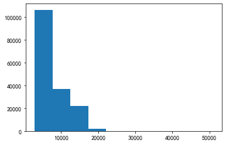

---
jupyter:
  kernelspec:
    display_name: Python 3
    language: python
    name: python3
  language_info:
    codemirror_mode:
      name: ipython
      version: 3
    file_extension: .py
    mimetype: 'text/x-python'
    name: python
    nbconvert_exporter: python
    pygments_lexer: ipython3
    version: 3.7.3
  nbformat: 4
  nbformat_minor: 2
---

::: {.cell .markdown}
第八章：第三次上机实验
======================
:::

::: {.cell .markdown}
```{=html}
<h3>本次上机实验的目标是：</h3>
```
```{=html}
<ul>
<li>探索在各种图像上做局部平均的效果。</li>
    <li>查看如何使用这种平均对图像降噪。</li>
    <li>使用特定的滤波器增强指定的图像特性。</li>
</ul>
```
:::

::: {.cell .markdown}
8.1 卷积 {#81-卷积}
--------
:::

::: {.cell .markdown}
我们在《概率论与数理统计》中学过卷积，两个随机变量和的分布是一个卷积公式.
这里我们来看一下卷积的一些应用
:::

::: {.cell .markdown}
对图像数组$I$使用滤波器数组$F$做二维离散卷积$C$的通用定义是:
$$C_{i,j}=\sum_{k,l}F_{k,l}I_{i-k,j-l}$$
求和的范围是所有分别指向数组$F$和$I$的合法条目的$k$值和$l$值.
:::

::: {.cell .markdown}
#### 练习8A
:::

::: {.cell .markdown}
\(a\) 考虑一个小转换，其中数组$F$是一个$1\times1$的矩阵, 唯一的元素是1.
解释为什么在这种情况下数组$C$和$I$是相同的？

答：因为$F$只有一个元素且值为1,
那么$k,l$的取值均为0，$i-k,j-l$的范围就是原来$I$数组的下标范围,
又因为$F$的值为1, 所以$C$和$I$大小和形状相同.

\(b\) 假定数组$F$的大小是$m\times n$, 数组$I$的大小是$M\times N$.
解释为什么数组$C$的大小是$(M+m-1)\times(N+n-1)$?

答：$C$的大小可以由$i,j$的变化范围确定,
$i,j$的最小值均为0，当$k$取到最大值$m-1$时，$i-k$的最大值是$M-1$,
$i$的最大值是$M+m-2$, 即$i$的变化范围是\[0,$M+m-2$\], 一共$M+m-1$个元素,
同理可得$j$的变化范围.
:::

::: {.cell .markdown}
### 8.1.1 Python的图像处理工具 {#811-python的图像处理工具}
:::

::: {.cell .markdown}
scipy.ndimage是SciPy下面的一共图像函数库, 我们把它导入成sim

sim.convolve是scipy.ndimage中的一个函数，用help可以看到更多的信息

我们来探索一下卷积的应用.
:::

::: {.cell .code execution_count="1"}
``` {.python}
import scipy.ndimage as sim, numpy as np, matplotlib.pyplot as plt
import matplotlib as mpl
mpl.rcParams['font.sans-serif'] = ['FangSong'] # 指定默认字体
mpl.rcParams['axes.unicode_minus'] = False # 解决保存图像是负号'-'显示为方块的问题
%config InlineBackend.figure_format = 'retina'
```
:::

::: {.cell .code execution_count="2"}
``` {.python}
impulse = np.zeros((51, 51)) #产生一个2维零数组
impulse[25,25] = 1.0         #二维零数组的中间点值设为1
my_filter_small = np.ones((3,3))/9     #设置一共均匀的方形数组，数组所有值的和为1
response = sim.convolve(impulse, my_filter_small)  #调用函数做卷积
plt.imshow(response)
```

::: {.output .execute_result execution_count="2"}
    <matplotlib.image.AxesImage at 0x192b2aae7f0>
:::

::: {.output .display_data}
{height="248"
width="251"}
:::
:::

::: {.cell .markdown}
impulse和response两个数组大小一样,
这个是sim.convolve的缺省设置mode=\'reflect\', 通过help可以查看其它选择.

由公式(8.1)：

$C[0,0]=F[0,0]\times I[0,0],$

$C[M+m-2, N+n-2] = F[m-1, n-1]\times I[M-1, N-1]$

所以卷积生成的图像边缘会产生失真. mode=\'reflect\'会对边缘进行修剪,
返回卷积图像的中心部分.
:::

::: {.cell .markdown}
### 8.1.2 图像平均 {#812-图像平均}
:::

::: {.cell .markdown}
一个简单的滤波器会对每个指定区域中的点分配同样的权重。在卷积后的图像中，每个点是原始图像中近邻点的平均值
:::

::: {.cell .markdown}
获取数据集16catphoto的图像
:::

::: {.cell .code execution_count="3"}
``` {.python}
filepath = r'D:\我的课程\计算物理\Datasets\16catphoto\\'
photo = plt.imread(filepath + 'bwCat.tif')
plt.imshow(photo,cmap='gray')
```

::: {.output .execute_result execution_count="3"}
    <matplotlib.image.AxesImage at 0x192b62cdb38>
:::

::: {.output .display_data}
{height="250"
width="326"}
:::
:::

::: {.cell .markdown}
#### 任务
:::

::: {.cell .markdown}
##### (a) 用前面例子定义的滤波器，调用sim.convolve做卷积, 并与sim.uniform\_filter做比较 {#a-用前面例子定义的滤波器调用simconvolve做卷积-并与simuniform_filter做比较}
:::

::: {.cell .code execution_count="4"}
``` {.python}
%%time
#这里%%time是ipython的魔法命令, 可以返回程序运行时间估计
plt.figure('sim.convolve')
response= sim.convolve(photo, my_filter_small)
plt.imshow(response,cmap='gray')
```

::: {.output .stream .stdout}
    Wall time: 17 ms
:::

::: {.output .execute_result execution_count="4"}
    <matplotlib.image.AxesImage at 0x192b6350470>
:::

::: {.output .display_data}
{height="250"
width="326"}
:::
:::

::: {.cell .code execution_count="5"}
``` {.python}
%%time
response2 = sim.uniform_filter(photo) #使用程序库自带均匀滤波器
plt.figure('uniform_filter')
plt.imshow(response2,cmap='gray')
```

::: {.output .stream .stdout}
    Wall time: 16 ms
:::

::: {.output .execute_result execution_count="5"}
    <matplotlib.image.AxesImage at 0x192b63b9a90>
:::

::: {.output .display_data}
{height="250"
width="326"}
:::
:::

::: {.cell .markdown}
##### (b) 使用一个具有适当值的$15\times 15$的数组，构成一共大正方形滤波器, 重复(a)中的操作
:::

::: {.cell .code execution_count="6"}
``` {.python}
%%time
my_filter_big = np.ones((15,15))*1/225
response = sim.convolve(photo, my_filter_big)
plt.figure('big filter')
plt.imshow(response, cmap='gray')
```

::: {.output .stream .stdout}
    Wall time: 147 ms
:::

::: {.output .execute_result execution_count="6"}
    <matplotlib.image.AxesImage at 0x192b642d470>
:::

::: {.output .display_data}
{height="250"
width="326"}
:::
:::

::: {.cell .code execution_count="7"}
``` {.python}
%%time
response2 = sim.uniform_filter(photo,size=15)
plt.figure('uniform_filter')
plt.imshow(response2,cmap='gray')
```

::: {.output .stream .stdout}
    Wall time: 20.5 ms
:::

::: {.output .execute_result execution_count="7"}
    <matplotlib.image.AxesImage at 0x192b653e940>
:::

::: {.output .display_data}
{height="250"
width="326"}
:::
:::

::: {.cell .markdown}
##### (c) 使用公式(8.1)的定义编写程序， 显示卷积生成的图像，图像中的每个点是原始图像中邻近像素的平均值. {#c-使用公式81的定义编写程序-显示卷积生成的图像图像中的每个点是原始图像中邻近像素的平均值}
:::

::: {.cell .code execution_count="9"}
``` {.python}
def myConvolve(func,img):
    """
    公式(8.1) C_{i,j} = sum_{k,l}{F_{k,l}*I_{i-k,j-l}}
    """
    ni, nj = img.shape
    nk, nl = func.shape
    c = np.zeros((ni+nk-1, nj+nl-1))
    for i in range(ni+nk-1):
        for j in range(nj+nl-1):
            s = 0.
            for k in range(min(i, nk)):
                for l in range(min(j, nl)):
                    if (i-k)<ni and (j-l)<nj:
                        s += func[k,l]*img[i-k, j-l]
            c[i,j] = s
    return c
```
:::

::: {.cell .code execution_count="12"}
``` {.python}
%%time
response = myConvolve(photo, my_filter_small)
plt.figure('my Convolve')
plt.imshow(response, cmap='gray')
```

::: {.output .error ename="KeyboardInterrupt" evalue=""}
    ---------------------------------------------------------------------------
    KeyboardInterrupt                         Traceback (most recent call last)
    <timed exec> in <module>

    <ipython-input-9-aa6cc812dc0a> in myConvolve(func, img)
         11             for k in range(min(i, nk)):
         12                 for l in range(min(j, nl)):
    ---> 13                     if (i-k)<ni and (j-l)<nj:
         14                         s += func[k,l]*img[i-k, j-l]
         15             c[i,j] = s

    KeyboardInterrupt: 
:::
:::

::: {.cell .markdown}
### 8.1.3 使用高斯滤波器做平滑 {#813-使用高斯滤波器做平滑}
:::

::: {.cell .markdown}
高斯滤波是一种略微复杂的滤波器,
和均匀滤波器的区别是原始图像点的权重不同.
:::

::: {.cell .markdown}
##### 导入数据: gauss\_filter.npy {#导入数据-gauss_filternpy}
:::

::: {.cell .code execution_count="13"}
``` {.python}
#gauss_filter.csv
filepath = r'D:\我的课程\计算物理\Datasets\16catphoto\\'
gauss = np.load(filepath + 'gauss_filter.npy')
plt.imshow(gauss)
```

::: {.output .execute_result execution_count="13"}
    <matplotlib.image.AxesImage at 0x192b7bca400>
:::

::: {.output .display_data}
{height="248"
width="248"}
:::
:::

::: {.cell .markdown}
#### 任务： {#任务}
:::

::: {.cell .markdown}
##### (a) 显示原始图像的高斯卷积（尝试使用sim.gauss\_filter函数， 使用关键字参数 \"sigma = 5\"） {#a-显示原始图像的高斯卷积尝试使用simgauss_filter函数-使用关键字参数-sigma--5}
:::

::: {.cell .code execution_count="14"}
``` {.python}
smooth = sim.gaussian_filter(gauss, sigma=5)
plt.figure('smooth')
plt.imshow(smooth)
```

::: {.output .execute_result execution_count="14"}
    <matplotlib.image.AxesImage at 0x192b7c34208>
:::

::: {.output .display_data}
{height="248"
width="248"}
:::
:::

::: {.cell .markdown}
##### (b) 调用plt.imshow函数，比较使用高斯滤波器的单一点卷积与实验8.1.2(b)所使用的正方滤波器 {#b-调用pltimshow函数比较使用高斯滤波器的单一点卷积与实验812b所使用的正方滤波器}
:::

::: {.cell .code execution_count="15" scrolled="true"}
``` {.python}
fig = plt.figure('square')
gauss_filter = sim.gaussian_filter(gauss,sigma=5)
plt.subplot(1,2,1)
plt.imshow(gauss_filter)
plt.subplot(1,2,2)
square_big = sim.convolve(gauss, my_filter_big)
plt.imshow(square_big)
```

::: {.output .execute_result execution_count="15"}
    <matplotlib.image.AxesImage at 0x192b7cc8cc0>
:::

::: {.output .display_data}
{height="183"
width="366"}
:::
:::

::: {.cell .markdown}
##### (c) 调用plot\_surface, 从3个维度上查看实验(b)中的卷积图像。使用卷积的定义介绍原因，然后解释使用高斯滤波器和正方滤波器有哪些不同，在哪些情况下人们更倾向高斯滤波器。
:::

::: {.cell .code execution_count="16"}
``` {.python}
from mpl_toolkits.mplot3d import Axes3D
fig = plt.figure('gauss')
ax1 = fig.add_subplot(121, projection='3d')
x, y = np.mgrid[0:45:45j, 0:45:45j]
ax1.plot_surface(x, y, smooth)
ax2 = fig.add_subplot(122, projection='3d')
ax2.plot_surface(x, y, square_big)
```

::: {.output .execute_result execution_count="16"}
    <mpl_toolkits.mplot3d.art3d.Poly3DCollection at 0x192b7f4d048>
:::

::: {.output .display_data}
{height="231"
width="349"}
:::
:::

::: {.cell .markdown}
8.2 图像去噪 {#82-图像去噪}
------------
:::

::: {.cell .markdown}
#### 任务 {#任务}
:::

::: {.cell .markdown}
##### (a) 对原始图像的每个点乘以一个介于0和1之间的随机数，然后将所得的的矩阵按上述步骤进行转换，比较生成的噪声图像和原始图像
:::

::: {.cell .code execution_count="17"}
``` {.python}
x, y = photo.shape #图像的形状
noise = np.random.random((x,y))  #产生[0，1]之间的随机噪声
Photo_noise = photo*noise     #给原数据添加噪声
mi = Photo_noise.min()
ma = Photo_noise.max()
Photo_noise = (Photo_noise-mi)/(ma-mi)*255
Photo_noise = Photo_noise.astype('uint8')
fig, axes = plt.subplots(1,2)
axes[0].imshow(photo)
axes[1].imshow(Photo_noise)
```

::: {.output .execute_result execution_count="17"}
    <matplotlib.image.AxesImage at 0x192b89c54e0>
:::

::: {.output .display_data}
{height="147"
width="371"}
:::
:::

::: {.cell .markdown}
##### (b) 将8.1.2和8.1.3中给出的每个滤波器(小正方形滤波器，大正方形滤波器和高斯滤波器)应用到实验(a)生成的噪声图像上。哪个滤波器的效果最好？ {#b-将812和813中给出的每个滤波器小正方形滤波器大正方形滤波器和高斯滤波器应用到实验a生成的噪声图像上哪个滤波器的效果最好}
:::

::: {.cell .code execution_count="62"}
``` {.python}
fig, axes = plt.subplots(1,3)
small_square = sim.uniform_filter(Photo_noise, size = 3)  #小正方滤波器
axes[0].imshow(small_square)
big_square = sim.uniform_filter(Photo_noise, size = 15)   #大正方滤波器
axes[1].imshow(big_square)
gauss = sim.gaussian_filter(Photo_noise, sigma=3)         #高斯滤波器
axes[2].imshow(gauss)
```

::: {.output .execute_result execution_count="62"}
    <matplotlib.image.AxesImage at 0x1760cfed860>
:::
:::

::: {.cell .markdown}
8.3 特征强调 {#83-特征强调}
------------
:::

::: {.cell .markdown}
##### 获取数据集17stressFibers
:::

::: {.cell .code execution_count="23"}
``` {.python}
filepath = r'D:\我的课程\计算物理\Datasets\17stressFibers\\'
stressFibers = np.load(filepath + 'stressFibers.npy')
```
:::

::: {.cell .markdown}
##### 调整数组比例

经实践发现调整数组比例会产生比较奇怪的结果，所以最终选择不调整
:::

::: {.cell .code execution_count="24"}
``` {.python}
#smin, smax = stressFibers.min(), stressFibers.max()
#stressFibers = (stressFibers - smin)/(smax-smin)*255
#stressFibers = stressFibers.astype('uint8')
plt.figure('original')
plt.imshow(stressFibers)
```

::: {.output .execute_result execution_count="24"}
    <matplotlib.image.AxesImage at 0x1760eb35fd0>
:::

::: {.output .display_data}

:::
:::

::: {.cell .code execution_count="25"}
``` {.python}
plt.hist(stressFibers.ravel())
```

::: {.output .execute_result execution_count="25"}
    (array([1.0634e+05, 3.6711e+04, 2.1779e+04, 1.9430e+03, 8.7000e+01,
            2.4000e+01, 1.8000e+01, 2.6000e+01, 6.0000e+00, 1.0000e+01]),
     array([ 2894. ,  7697.8, 12501.6, 17305.4, 22109.2, 26913. , 31716.8,
            36520.6, 41324.4, 46128.2, 50932. ]),
     <a list of 10 Patch objects>)
:::

::: {.output .display_data}

:::
:::

::: {.cell .markdown}
#### 任务： {#任务}
:::

::: {.cell .markdown}
##### (a) 执行下面的代码，并绘制滤波器的曲面图，描述其中的显著特性
:::

::: {.cell .code execution_count="26"}
``` {.python}
from mpl_toolkits.mplot3d import Axes3D
v = np.arange(-25, 26)
X, Y = np.meshgrid(v, v)
gauss_filter = np.exp(-0.5*(X**2/5 + Y**2/45))
fig = plt.figure('Gauss filter')
ax = fig.add_subplot(111, projection='3d')
ax.plot_surface(X, Y, gauss_filter, rstride=5, cstride=5)
ax.set_xlabel('x')
ax.set_ylabel('y')
```

::: {.output .execute_result execution_count="26"}
    Text(0.5, 0, 'y')
:::

::: {.output .display_data}

:::
:::

::: {.cell .markdown}
##### (b) 使用下面的"黑箱"代码修改实验(a)中的滤波器，然后使用生成的滤波器绘制曲面图，比较combined\_filter和gauss\_filter之间的共性和差异
:::

::: {.cell .code execution_count="27"}
``` {.python}
laplace_filter=np.array([[0,-1,0],[-1,4,-1],[0,-1,0]])
combined_filter = sim.convolve(gauss_filter, laplace_filter)
```
:::

::: {.cell .code execution_count="28"}
``` {.python}
fig = plt.figure('combined filter')
ax = fig.add_subplot(111, projection='3d')
ax.plot_surface(X, Y, combined_filter, rstride=5, cstride=5)
ax.set_xlabel('x')
ax.set_ylabel('y')
```

::: {.output .execute_result execution_count="28"}
    Text(0.5, 0, 'y')
:::

::: {.output .display_data}

:::
:::

::: {.cell .markdown}
gauss\_filter强调垂直特性，combined\_filter强调这类对象的边缘。
:::

::: {.cell .markdown}
##### (c) 调用sim.convolve，将滤波器应用到纤维图像，显示并分析结果。 {#c-调用simconvolve将滤波器应用到纤维图像显示并分析结果}
:::

::: {.cell .code execution_count="29"}
``` {.python}
fig = plt.figure('Combined Filter result')
ax = fig.add_subplot(111)
combined1 = sim.convolve(stressFibers, combined_filter)
ax.imshow(combined1, vmin=0,vmax=0.5*combined1.max())
combined1.min()
```

::: {.output .execute_result execution_count="29"}
    -45812.58894866888
:::

::: {.output .display_data}

:::
:::

::: {.cell .markdown}
##### (d) 为强调水平对象，选取不同的gauss\_filter, 重复上面的步骤
:::

::: {.cell .code execution_count="30"}
``` {.python}
gauss_filter2 = np.exp(-0.5*(X**2/45 + Y**2/5))
laplace_filter=np.array([[0,-1,0],[-1,4,-1],[0,-1,0]])
combined_filter2 = sim.convolve(gauss_filter2, laplace_filter)
fig = plt.figure('横滤波')
ax = fig.add_subplot(111)
combined2 = sim.convolve(stressFibers, combined_filter2)
ax.imshow(combined2, vmin=0,vmax=0.4*combined2.max())
```

::: {.output .execute_result execution_count="30"}
    <matplotlib.image.AxesImage at 0x1760f1953c8>
:::

::: {.output .display_data}

:::
:::

::: {.cell .markdown}
##### 选做实验：创建另外两个滤波器，实现强调相对于垂直+/-45度方向的对象
:::

::: {.cell .code execution_count="31"}
``` {.python}
gauss_filter3 = np.exp(-0.5*(X**2/45 + Y**2/5))
laplace_filter=np.array([[0,-1,0],[-1,4,-1],[0,-1,0]])
combined_filter3 = sim.convolve(gauss_filter2, laplace_filter)
rotate_combined_filter3 = sim.rotate(combined_filter3, 45)
fig = plt.figure('45度滤波')
ax = fig.add_subplot(111)
combined3 = sim.convolve(stressFibers, rotate_combined_filter3)
ax.imshow(combined3, vmin=0, vmax = 0.5*combined3.max())
```

::: {.output .execute_result execution_count="31"}
    <matplotlib.image.AxesImage at 0x1760f4aac88>
:::

::: {.output .display_data}

:::
:::

::: {.cell .code execution_count="32"}
``` {.python}
gauss_filter4 = np.exp(-0.5*(X**2/45 + Y**2/5))
laplace_filter=np.array([[0,-1,0],[-1,4,-1],[0,-1,0]])
combined_filter4 = sim.convolve(gauss_filter4, laplace_filter)
rotate_combined_filter4 = sim.rotate(combined_filter4, -45)
fig = plt.figure('-45度滤波')
ax = fig.add_subplot(111)
combined4 = sim.convolve(stressFibers, rotate_combined_filter4)
ax.imshow(combined4, vmin=0, vmax = 0.5*combined4.max())
```

::: {.output .execute_result execution_count="32"}
    <matplotlib.image.AxesImage at 0x1760f7ca470>
:::

::: {.output .display_data}

:::
:::

::: {.cell .code}
``` {.python}
```
:::
